# CourseGenie AI — Screenshots

All screenshots below were taken from the live running application at `localhost:3000`.

---

## 01 · Sign Up Page
**File:** `01-signup.jpeg`

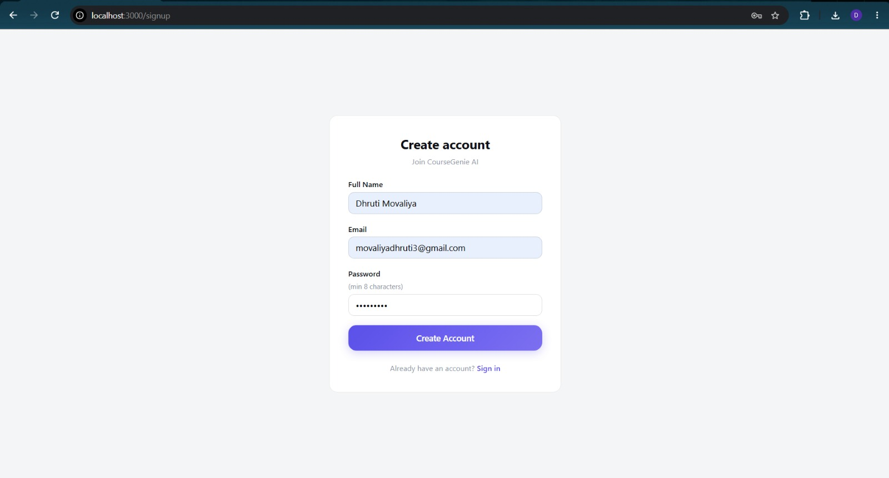

New user registration form — Create Account page at `/signup`. Collects full name, email, and password to join CourseGenie AI.

---

## 02 · Login Page
**File:** `02-login.jpeg`

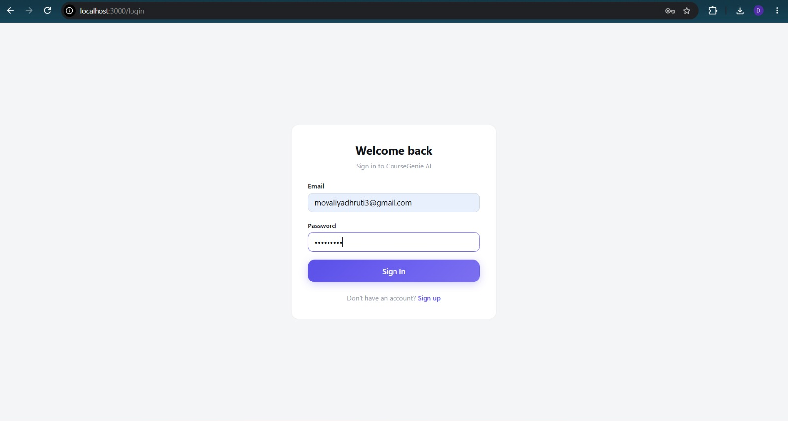

Sign-in screen at `/login`. Returning users authenticate with email and password to access their course dashboard.

---

## 03 · Dashboard — Your Courses
**File:** `03-dashboard.jpeg`

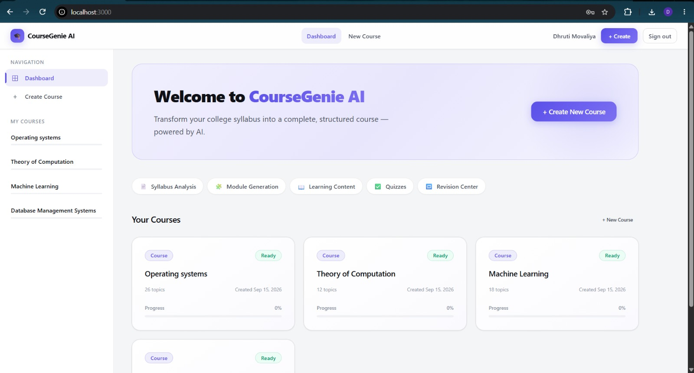

Main dashboard at `/`. Displays all AI-generated courses (Operating Systems, Theory of Computation, Machine Learning, DBMS) as cards with topic count and progress. Feature pills highlight: Syllabus Analysis · Module Generation · Learning Content · Quizzes · Revision Center.

---

## 04 · Module Review — Course Creation Step 2
**File:** `04-create-course-module-review.jpeg`

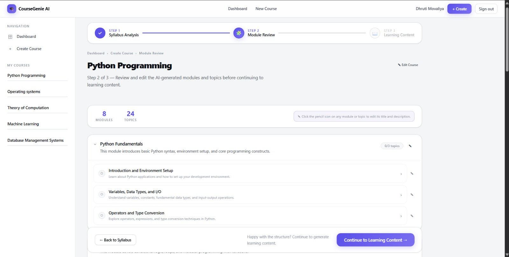

Step 2 of 3 in the Create Course wizard for **Python Programming**. The AI has generated 8 modules and 24 topics from the submitted syllabus. Professors can review and edit each module/topic title before continuing to learning content generation.

---

## 05 · Course Overview — Machine Learning
**File:** `05-course-overview.jpeg`

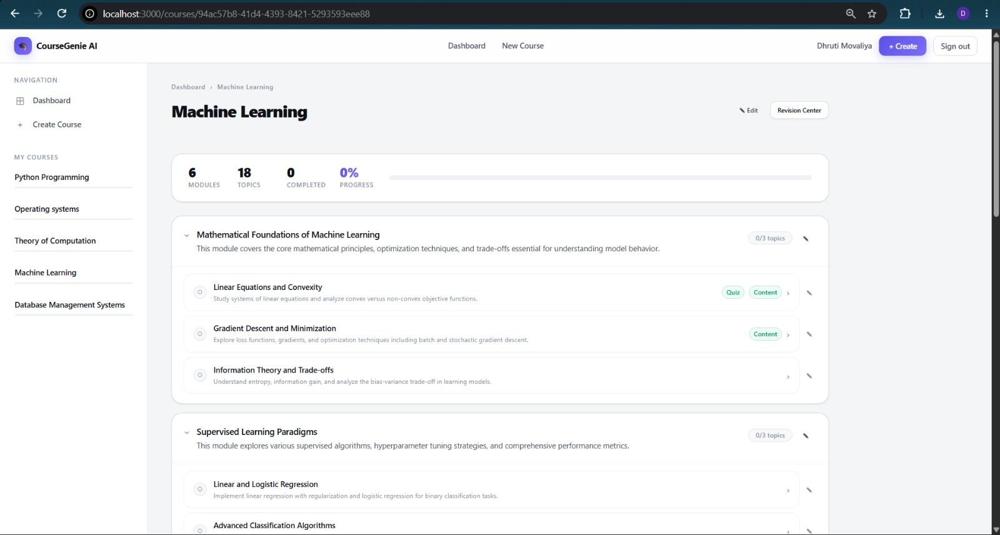

Course detail page for **Machine Learning** — 6 modules, 18 topics. Topics are listed under each module with Quiz/Content status badges. Individual topics can be opened for learning content or quizzes.

---

## 06 · Topic Learning — Learning Objectives
**File:** `06-topic-learning-objectives.jpeg`

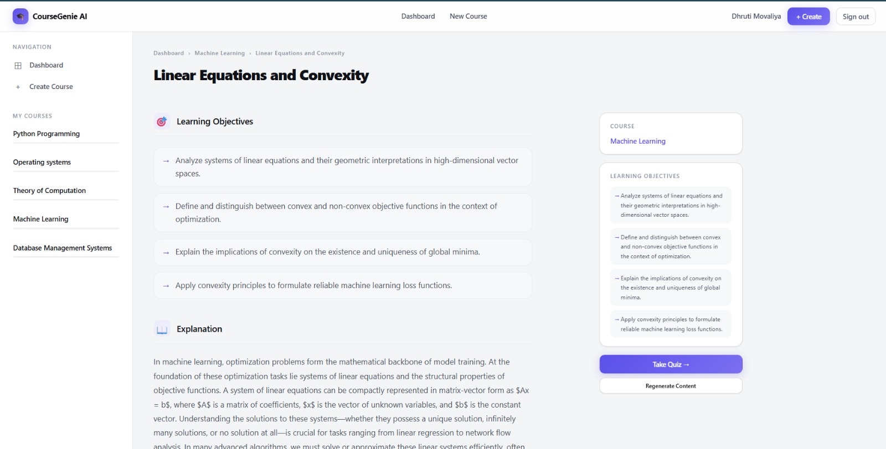

Topic learning page for **Linear Equations and Convexity** (Machine Learning course). Shows the AI-generated Learning Objectives section with 4 structured objectives. Right sidebar shows course context, a summary of objectives, and quick-access buttons: **Take Quiz** and **Regenerate Content**.

---

## 07 · Topic Learning — Examples & Summary
**File:** `07-topic-learning-summary.jpeg`

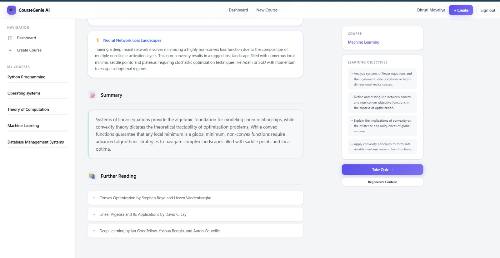

Lower section of the same topic page — displays a real-world example card (Neural Network Loss Landscapes), a topic **Summary** paragraph, and a **Further Reading** list with three referenced textbooks.

---

## 08 · Quiz — Active Question
**File:** `08-quiz-active-question.jpeg`

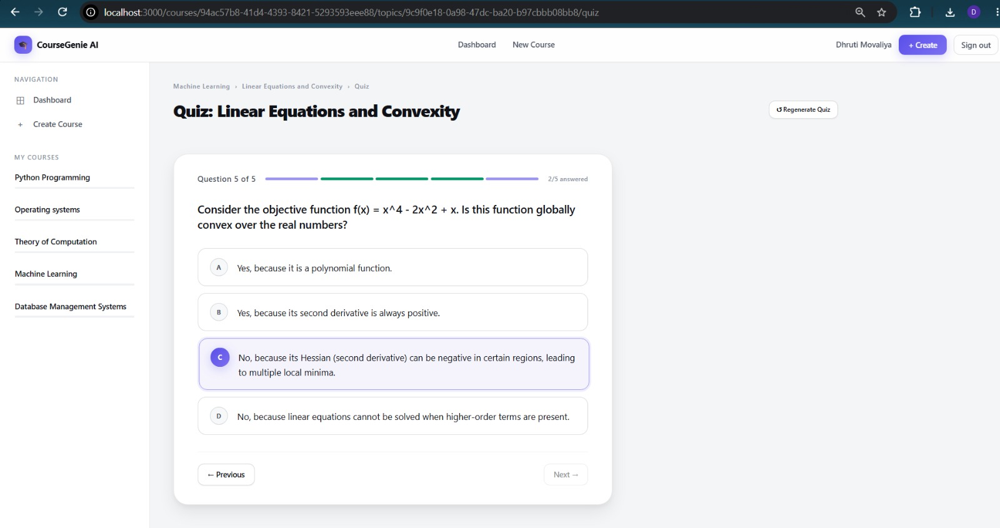

AI-generated quiz for **Linear Equations and Convexity** — Question 5 of 5. MCQ with 4 answer options; option C is selected. Progress bar shows 2/5 answered. A **Regenerate Quiz** button is available in the top-right corner.

---

## 09 · Quiz — Score & Results Summary
**File:** `09-quiz-results.jpeg`

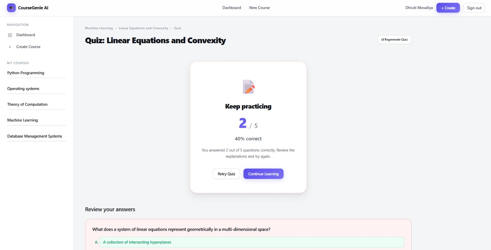

Post-quiz results screen — scored 2/5 (40%). Shows "Keep practicing" feedback with options to **Retry Quiz** or **Continue Learning**. Below the score card, each question is reviewed with correct/incorrect highlighting.

---

## 10 · Quiz — Answer Review with Explanations
**File:** `10-quiz-answer-review.jpeg`

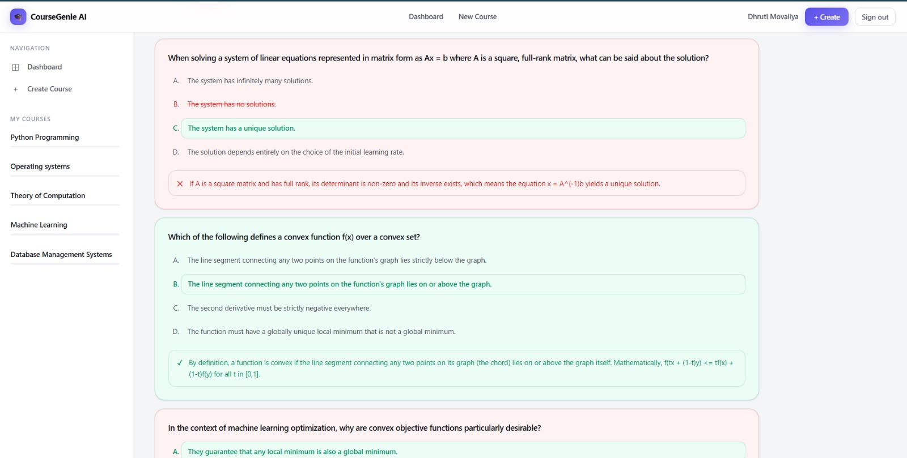

Detailed answer review section below the score. Correct answers are highlighted in green with AI-written explanations; incorrect answers are shown in red with strikethrough. Covers two questions in this view: systems of linear equations and convex function definition.

---

## 11 · Revision Center — Quick Notes
**File:** `11-revision-quick-notes.jpeg`

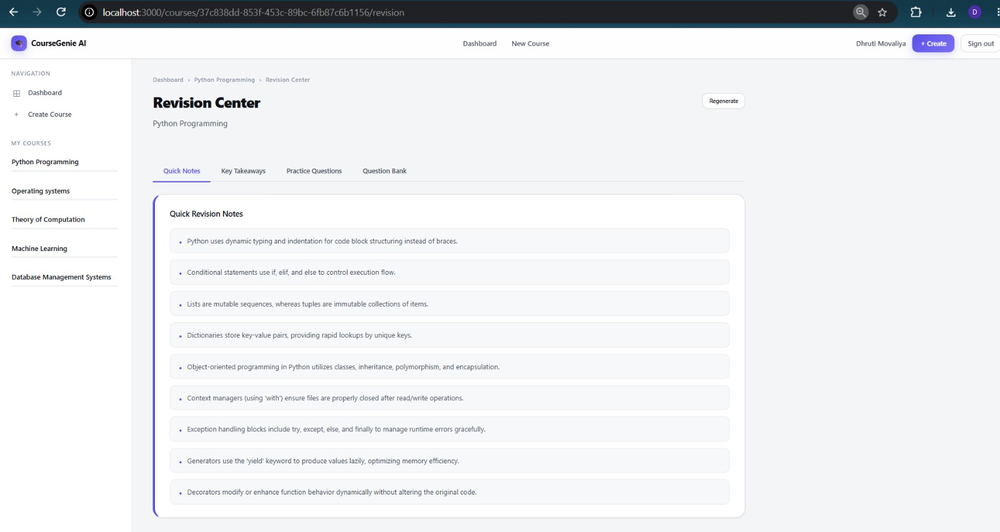

Revision Center for **Python Programming** at `/revision`. **Quick Notes** tab — AI-generated bullet-point quick revision notes covering the full course (dynamic typing, conditionals, lists/tuples, OOP, context managers, exception handling, generators, decorators). **Regenerate** button available top-right.

---

## 12 · Revision Center — Key Takeaways
**File:** `12-revision-key-takeaways.jpeg`

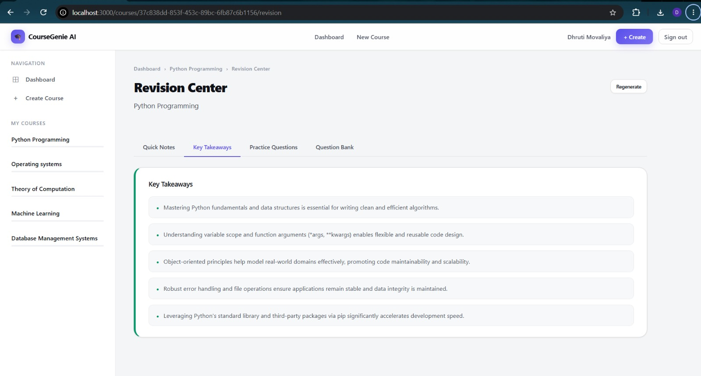

**Key Takeaways** tab in the Revision Center. Five high-level course-wide takeaways synthesised by AI — covering Python fundamentals, variable scope, OOP principles, error handling, and the standard library.

---

## 13 · Revision Center — Practice Questions
**File:** `13-revision-practice-questions.jpeg`

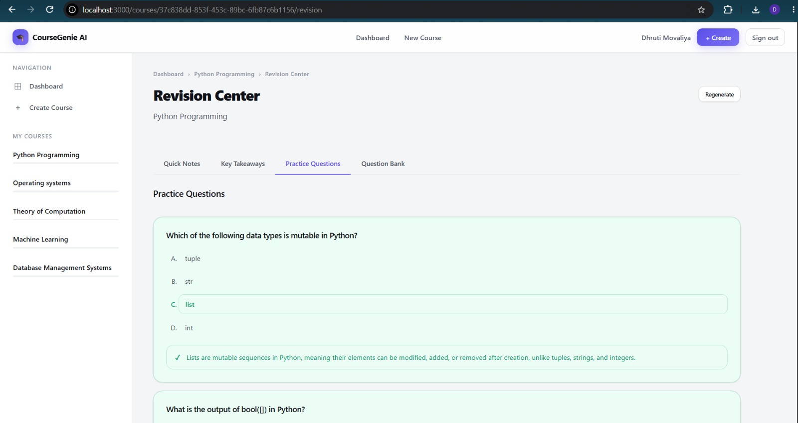

**Practice Questions** tab — MCQ practice set with correct answers highlighted in green (option C: `list`) and AI-written explanations shown inline after each question.

---

## 14 · Revision Center — Question Bank (Collapsed)
**File:** `14-revision-question-bank-collapsed.jpeg`

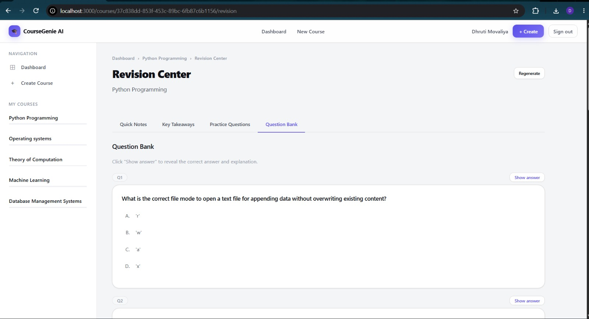

**Question Bank** tab — full course-wide question bank. Questions are collapsible (Q1, Q2, …) with a **Show answer** button per question. Allows self-study without answers accidentally visible.

---

## 15 · Revision Center — Question Bank (Expanded)
**File:** `15-revision-question-bank-expanded.jpeg`

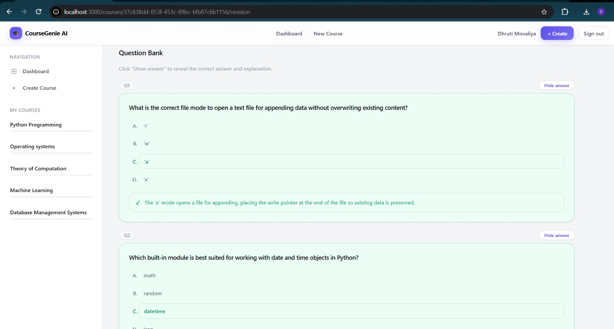

Same Question Bank with Q1 expanded — answer revealed (option C: `'a'` mode) with a full AI explanation shown in a green callout. Q2 begins below. **Hide answer** button replaces the Show answer toggle when expanded.

---

## Summary

| # | File | Page / Feature |
|---|------|----------------|
| 01 | `01-signup.jpeg` | Sign Up |
| 02 | `02-login.jpeg` | Login |
| 03 | `03-dashboard.jpeg` | Dashboard — course cards |
| 04 | `04-create-course-module-review.jpeg` | Create Course — Module Review (Step 2) |
| 05 | `05-course-overview.jpeg` | Course Overview — Machine Learning |
| 06 | `06-topic-learning-objectives.jpeg` | Topic Learning — Learning Objectives |
| 07 | `07-topic-learning-summary.jpeg` | Topic Learning — Examples & Summary |
| 08 | `08-quiz-active-question.jpeg` | Quiz — Active Question |
| 09 | `09-quiz-results.jpeg` | Quiz — Score & Results |
| 10 | `10-quiz-answer-review.jpeg` | Quiz — Answer Review |
| 11 | `11-revision-quick-notes.jpeg` | Revision Center — Quick Notes |
| 12 | `12-revision-key-takeaways.jpeg` | Revision Center — Key Takeaways |
| 13 | `13-revision-practice-questions.jpeg` | Revision Center — Practice Questions |
| 14 | `14-revision-question-bank-collapsed.jpeg` | Revision Center — Question Bank (collapsed) |
| 15 | `15-revision-question-bank-expanded.jpeg` | Revision Center — Question Bank (expanded) |
